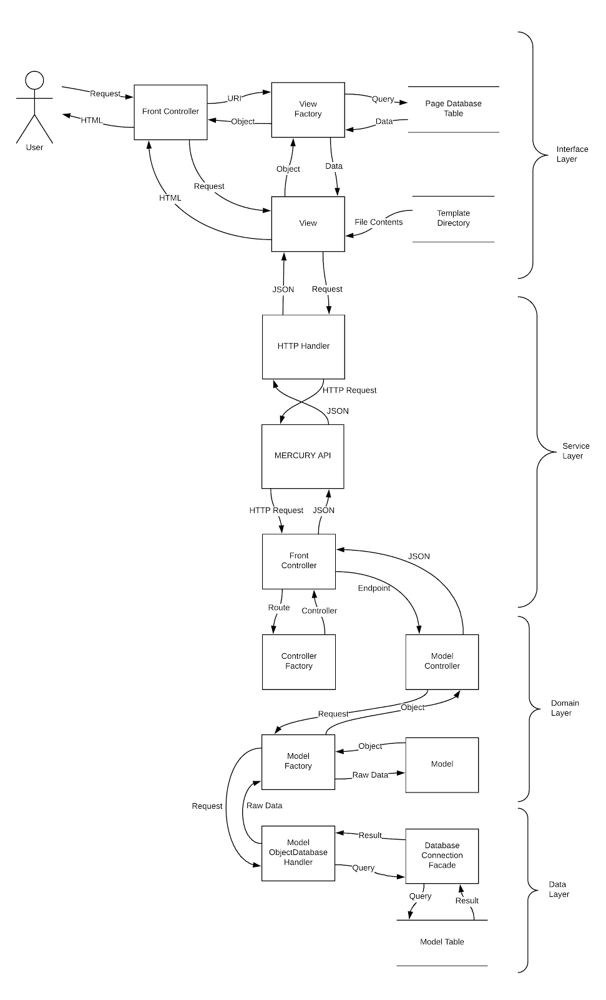

# NetCenter v4
LLR Technologies & Associated Services  
Network Central Administrative Toolbox  
Built on the MERCURY platform

## Development Team

* Lorenzo L. Romero

## Background

NetCenter is the name given to a web application consisting of administrative 'widgets' that manage information regarding 
the operations of network services in my household.  As of April 25th, 2019, these widgets consist of the following:  

* Facilities - physical buildings and locations
* Inventory - fixed assets, purchase orders, returns, discards, storage
* Devices - IP and MAC addresses
* Monitor - Online status of specified hosts
* Web - VHost, website logs, and URL aliases
* Services - Applications and services installed on servers or clients
* Tickets - Work order process system

Access to these widgets is through a single web portal, with access controlled by roles which are in turn delegated 
permission sets.  With different combinations of permission sets, a wide variety of user types is possible.

NetCenter version 3 was developed in late-2018 in an effort to modernize this management utility; it was developed on 
top of the then-new ISD-FASTAPPS platform, an object-oriented PHP web application framework created in-house that 
allowed for functionality to be developed in modular 'extensions' that could be enabled and disabled as required.

Soon after the production deployment of NetCenter 3, several critical flaws were discovered:

* The load of client connections was largely on the server, which not only processed user actions but was responsible for
recording the 'cache' of user actions

* Since the use of the PHP class autoloader was not looked into, every class file used by the entire application was 
imported at each page load

* Several functions were written procedurally, which could lead to name conflicts, and is generally not good practice

* Due to the direct relationship between the web application and database, information stored in the NetCenter database 
was not accessible by outside services or applications

Additionally, in the months following the release of NetCenter 3, a different approach to developing web applications was
adopted by ISD that conformed more closely to MVC; different code languages were strictly segregated, leading to cleaner 
code files.


## Project Description

NetCenter is a collection of administrative tools that allow for the management of information pertaining to network 
operations. These tools are grouped into the following 'modules':

###  Facilities Management

* Manage buildings
* Manage locations (i.e. rooms) within those buildings

### Inventory Management

* Record the procurement of physical assets from vendors through purchase orders
* Track the deployment or storage location (see Facilities Management) of an asset
* Track assets sent in for repairs/returns to a vendor
* Track asset discards

### Device Management

* Associate a MAC and IP address with an asset (see Inventory Management)
* Record nodes about operating system and system specifications (optional)

### Monitoring & Reporting

* Determine what devices are online, and when
* Display a dashboard showing device categories (defined by user) consisting of host devices

### Web Management

* Record current and former web domain names and virtual hosts, and their use
* Track when web domain names were registered and when they expire
* Manage alias addresses created on *.llrny.com
* View web server logs in browser (instead of having to remote in)

### Application Inventory & Tracking

* Track what programs or services are installed on what computers
* Track open ports or virtual hosts an application is running on
* Determine what servers are hosting all or parts of an application
* Record different stages in the software development life cycle

### Service Center

* Track work orders or requests from creation to closure
* Provide separate workspaces for different types of projects

### Self-Service

* Allow users to change their account password, regardless of if it is a local account or LDAP-integrated

## Requirements

The primary goal of NetCenter version 4 is to allow flexible access to information outside the confines of the 
application itself, and to utilize the capabilities of modern browsers to take the load of a user connection off the 
server.

NetCenter 3, despite all faults, is a stable web application that is actively being used to manage network information. 
This, coupled with the desire to avoid changing databases a second time (partly because there is significant amounts of 
information, partly because no fault has been identified with the database schema), means that while NetCenter 4 should utilize 
the same information store as version 3, both applications should be able to run without interference at the same time.

At no point should the processing of information ('business rules') be changed prior to the retirement of NetCenter 3, to
ensure that 'bad data' (defined as data that the application would not be able to interpret or process) is not presented
to either application.

Beyond that the only other requirement is that all functionality of NetCenter 3 be represented in version 4; this 
includes CRUD operations on all objects by users with the correct privileges.

## Business Rules (selected)

Due to the large amount of business rules in place for the nearly 40 object types present, only the business rules for 
an Asset will be explained:

An asset:

* Must have originated from a purchase order
* Must have been supplied by a vendor
* Must have been purchased for an amount of money (including zero)
* Must be either deployed at a location, stored in a warehouse, on a return order, or discarded
* Must be tied to a commodity
* Must have a unique asset tag
* Must not be deleted from the system, even if it has been discarded

## Technologies Used

* PHP 7.3

* JavaScript/jQuery

* Materialize CSS library

* MySQL

* REST Service

## Design Patterns

### Model-View-Controller

Both the back-end service and front-end client segregate code based on their function: to represent data, to display 
data, and to process data.  For example, all the attributes associated with a User would appear in the following
model class located within the back-end service:

```php
namespace models\facilities;

class Building extends Model
{
    private $id;
    private $code;
    private $name;
    private $streetAddress;
    private $city;
    private $state;
    private $zipCode;
    private $createDate;
    private $createUser;
    private $lastModifyDate;
    private $lastModifyUser;
        
    /**
     * @return int
     */
    public function getId(): int
    {
        return $this->id;
    }
    
    ...
}
```

While the front-end might represent the page displayed for searching volumes like this:

```php
namespace views\pages\facilities;

use views\pages\ModelPage;

class BuildingViewPage extends ModelPage
{
    public function __construct(?string $buildingId)
    {
        parent::__construct("buildings/$buildingId", "facilitiescore_facilities-r", 'buildings');

        $building = $this->response->getBody();

        $this->setVariable("content", self::templateFileContents("facilities/Building", self::TEMPLATE_CONTENT));

        $this->setVariable("tabTitle", "Building - " . htmlentities($building['name']));

        $this->setVariable('id', $building['id']);
        $this->setVariable('code', htmlentities($building['code']));
        $this->setVariable('name', htmlentities($building['name']));
        $this->setVariable('streetAddress', htmlentities($building['streetAddress']));
        $this->setVariable('city', htmlentities($building['city']));
        $this->setVariable('state', htmlentities($building['state']));
        $this->setVariable('zipCode', htmlentities($building['zipCode']));
        $this->setVariable('createDate', htmlentities($building['createDate']));
        $this->setVariable('createUser', htmlentities($building['createUser']));
        $this->setVariable('lastModifyDate', htmlentities($building['lastModifyDate']));
        $this->setVariable('lastModifyUser', htmlentities($building['lastModifyUser']));
    }
}
```

In the above example, BuildingView is a distant child of the abstract View class, which contains functions for loading and 
manipulating HTML stored in separate template files such as this:

```html
<h2 class="region-title">Building Profile</h2>
<table class="table-display">
    <tbody>
        <tr>
            <td>Building Code</td>
            <td>{{@code}}</td>
            <td>Building Name</td>
            <td>{{@name}}</td>
        </tr>
        <tr>
            <td>Street Address</td>
            <td>{{@streetAddress}}</td>
            <td>City</td>
            <td>{{@city}}</td>
        </tr>
        <tr>
            <td>State</td>
            <td>{{@state}}</td>
            <td>Zip Code</td>
            <td>{{@zipCode}}</td>
        </tr>
    </tbody>
</table>
```

Placeholder variables, surrounded with {{@}}, are used by the following function in the abstract View class:

```php
/**
 * @param string $variableName
 * @param $value
 */
public function setVariable(string $variableName, $value)
{
    $this->template = str_replace("{{@$variableName}}", $value, $this->template);
}
```

With any remaining placeholders either removed or replaced with defaults when the page is rendered.

### Factory

In the back-end service there is a class called ControllerFactory with the following function:

```php
public static function getController(HTTPRequest $request): Controller
{
        $route = $request->next();
        switch($route)
        {
            case "commodities":
                return new CommodityController($request);
            case "warehouses":
                return new WarehouseController($request);
            case "vendors":
                return new VendorController($request);
            case "assets":
                return new AssetController($request);
            case "vhosts":
                return new VHostController($request);
            case "registrars":
                return new RegistrarController($request);
            case "applications":
                return new ApplicationController($request);
            case "buildings":
                return new BuildingController($request);
            case "locations":
                return new LocationController($request);
            case "users":
                return new UserController($request);
            case "roles":
                return new RoleController($request);
            case "permissions":
                return new PermissionController($request);
            case "currentUser":
                return new CurrentUserController($request);
            case "authenticate":
                return new AuthenticateController($request);
            default:
                throw new ControllerNotFoundException($route);
        }
}
```

This function is utilized by the FrontController to receive back a child-object of the abstract Controller class. This
abstract class defines a function called getResponse() that is able to process the received HTTPRequest and return 
either a response or NULL, indicating that controller does not have a function for processing the user's request.  Here
is an example of this function from AuthenticateController:

```php
public function getResponse(): ?HTTPResponse
{
    if($this->request->method() == HTTPRequest::POST)
    {
        switch($this->request->next())
        {
            case "login":
                return $this->loginUser();
        }
    }
    else if($this->request->method() == HTTPRequest::PUT)
    {
        switch($this->request->next())
        {
            case "logout":
                return $this->logoutUser();
        }
    }

    return NULL;
}
```

The factory limits the number of classes that the FrontController needs to be aware of.

### Facade

To enable a change in the database connection object, or allow alterations in how it functions, a class called
DatabaseConnection and a class called PreparedStatement were created to act as a gateway to whatever methods are
being used to call the underlying DBMS--in this case, PDO is being used.  Most functions present in these classes
are passthroughs to PDO functions of the same name, such as this one:

```php
public function query(string $query): \PDOStatement
{
    try
    {
        return $this->handler->query($query);
    }
    catch(\PDOException $e)
    {
        throw new DatabaseException(DatabaseException::MESSAGES[DatabaseException::DIRECT_QUERY_FAILED], DatabaseException::DIRECT_QUERY_FAILED, $e);
    }
}
```

### FrontController

This is the class that handles HTTP requests for both the front-end and back-end.  It's role is to determine the 
Universal Resource Identifier (URI, aka 'the part after the domain') that the browser is requesting, and generate 
a response--in the back-end this will be a JSON object, in the front-end this will be HTML.  Here is a sample of the
back-end FrontController determining the URI the browser requested, and generating an HTTPRequest:

```php
    // Get secret
    $key = self::currentSecret();

    // Determine URI
    if(isset($_SERVER['HTTPS']) AND $_SERVER['HTTPS'] == 'on')
        $url = "https";
    else
        $url = "http";

    $url .= "://" . $_SERVER['HTTP_HOST'] . $_SERVER['REQUEST_URI'];

    $urlParts = explode(\Config::OPTIONS['baseURL'] . \Config::OPTIONS['baseURI'], $url);

    if(isset($urlParts[1]))
        $uriParts = explode('/', $urlParts[1]);
    else
        $uriParts = array();

    // Create request
    $request = new HTTPRequest($key, $method, $uriParts, self::getRequestBodyAsArray());

    $response = ControllerFactory::getController($request)->getResponse();

    if($response == NULL)
        throw new RouteException(RouteException::MESSAGES[RouteException::REQUEST_INVALID], RouteException::REQUEST_INVALID);
```

## Layering

### Data Layer

This layer handles requests for CRUD operations from the business layer and carries out the requests against the DBMS.
There is the central database connection class (and prepared statement class), which we've already covered.  These 
classes are called by a series of database handler classes, one for each table--lookup tables have their functions 
within the database handler of the table where it makes the most sense, i.e. the function for getting entries from
User_Role is stored in the RoleDatabaseHandler--that contain functions for various CRUD operations.  The database layer
resides solely in the back-end service.  Here is an example of a database handler, in this case the handler for 
retrieving application 'secret' tokens:

```php
namespace database;


use exceptions\EntryNotFoundException;
use models\Secret;

class SecretDatabaseHandler extends DatabaseHandler
{
    /**
     * @param string $secret
     * @return Secret
     * @throws \exceptions\DatabaseException
     * @throws EntryNotFoundException
     */
    public static function selectBySecret(string $secret): Secret
    {
        $handler = new DatabaseConnection();

        $select = $handler->prepare("SELECT \"secret\", \"name\" FROM \"Secret\" WHERE \"secret\" = ? LIMIT 1");
        $select->bindParam(1, $secret, DatabaseConnection::PARAM_STR);
        $select->execute();

        $handler->close();

        if($select->getRowCount() === 1)
            return $select->fetchObject("models\Secret");

        throw new EntryNotFoundException(EntryNotFoundException::MESSAGES[EntryNotFoundException::PRIMARY_KEY_NOT_FOUND], EntryNotFoundException::PRIMARY_KEY_NOT_FOUND);
    }
}
```

### Business (Operator) Layer

This layer is comprised of 'operator' classes that are called by controllers, and will carry out any additional 
operations needed to perform a certain action.  In the following function from TokenOperator, a new token is generated,
and the current and expire time calculated, after a request for a new token from a controller, and before the token gets
inserted into the database:

```php
/**
 * @param int $user
 * @return Token
 * @throws \exceptions\DatabaseException
 * @throws \exceptions\EntryNotFoundException
 */
public static function generateNewToken(int $user): Token
{
    $token = hash('SHA512', openssl_random_pseudo_bytes(2048));
    $ipAddress = $_SERVER['REMOTE_ADDR'];
    $expired = 0;
    $issueTime = date('Y-m-d H:i:s');
    $expireTime = self::getOneHourFromNow();

    return TokenDatabaseHandler::insert($token, $user, $issueTime, $expireTime, $expired, $ipAddress);
}
```

If any additional operations need to be carried out, such as the update of other records stored in a different table,
they will be done within the operator.

### Domain Layer

This layer contains all model objects that represent data stored in the database.  Model objects are immutable: they
only serve to represent data, not modify it.  Model classes contain private attributes for each table column that is
being represented, and a corresponding public accessor for each.  There is no constructor: the objects are created from
the database layer's fetchObject() function.  See the return statement of the below example from PermissionDatabaseHandler:

```php
/**
 * @param string $code
 * @return Permission
 * @throws EntryNotFoundException
 * @throws \exceptions\DatabaseException
 */
public static function selectByCode(string $code): Permission
{
    $handler = new DatabaseConnection();

    $select = $handler->prepare("SELECT \"code\" FROM \"Permission\" WHERE \"code\" = ?");
    $select->bindParam(1, $code, DatabaseConnection::PARAM_STR);
    $select->execute();

    $handler->close();

    if($select->getRowCount() !== 1)
        throw new EntryNotFoundException(EntryNotFoundException::MESSAGES[EntryNotFoundException::PRIMARY_KEY_NOT_FOUND], EntryNotFoundException::PRIMARY_KEY_NOT_FOUND);

    return $select->fetchObject("models\Permission");
}
```

This is the class of the Permission object that would be created by that return statement:

```php
namespace models;

class Permission extends Model
{
    private $code;

    /**
     * @return string
     */
    public function getCode(): string
    {
        return $this->code;
    }
}
```

### Service Layer

Build around the REST service concept, the service layer allows retrieval and manipulation of data through a 
web-based interface.  In my opinion, this layer is represented by the entire back-end, but may be more appropriately
summed up by the function shown earlier of URI processing, and this code snippit, where the FrontController returns the
final results of the processing to the requester:

```php
// Reply to the request
header('Content-type: application/vnd.api+json');

// Request has been set
if($response !== NULL)
{
    http_response_code($response->getResponseCode());
    echo json_encode($response->getBody());
    exit;
}
```

### Interface Layer

Represented by the entire front-end, this is the portion of the application designed for direct user input.  This layer
contains its own FrontController, a series of controllers, views, and templates to generate pages, and a class for
making requests to the back-end.  Here is an example of this from a separate application being developed that uses
a service nearly identical to this one:

```php
namespace utilities;


use exceptions\InfoCentralException;
use models\HTTPResponse;

class InfoCentralConnection
{
    const GET = 0;
    const POST = 1;
    const PUT = 2;
    const DELETE = 3;

    /**
     * @param int $requestType
     * @param string $resource
     * @param array $data
     * @return HTTPResponse
     * @throws InfoCentralException
     */
    public static function getResponse(int $requestType, string $resource, array $data = array()): HTTPResponse
    {
        $link = curl_init(\Config::OPTIONS['icURL'] . $resource);

        switch($requestType)
        {
            case self::POST:
                $type = "POST";
                break;
            case self::PUT:
                $type = "PUT";
                break;
            case self::DELETE:
                $type = "DELETE";
                break;
            default:
                $type = "GET";
        }

        // Add API secret
        $headers = array(
            'Secret: ' . \Config::OPTIONS['icSecret']
        );

        // Add the user's token if it has been defined
        if(isset($_COOKIE[\Config::OPTIONS['cookieName']]))
            $headers[] = 'Token: ' . $_COOKIE[\Config::OPTIONS['cookieName']];

        curl_setopt($link, CURLOPT_HTTPHEADER, $headers);
        curl_setopt($link, CURLOPT_RETURNTRANSFER, TRUE);
        curl_setopt($link, CURLOPT_CUSTOMREQUEST, $type);
        curl_setopt($link, CURLOPT_POSTFIELDS, json_encode($data));

        $response = curl_exec($link);
        $responseCode = curl_getinfo($link, CURLINFO_HTTP_CODE);
        curl_close($link);

        if($responseCode == 500)
            throw new InfoCentralException(InfoCentralException::MESSAGES[InfoCentralException::IC_RESPONDED_500], InfoCentralException::IC_RESPONDED_500);

        if(!is_array($data = json_decode($response, TRUE)))
            $data = array();

        return new HTTPResponse($responseCode, $data);
    }
}
```

## Layer Concept Diagram


## Exception Handling

The FrontController provides the final exception handling in the following circumstances:

* An access violation occurs; either the application does not have permission to use a route or the authenticated user does not have permission to perform an action (403)
* A requested record within a route has not been found (404)
* No function exists in a controller to perform the request method and resource combination (404)
* A fatal, or otherwise unrecoverable error has occurred; an example of this is a database query failure (500)

Exceptions that the FrontController handles are allowed to bubble-up to it from classes further down the chain. However, 
a class may elect to handle its own exception catching, or convert one exception to another.  For example, the 
UserOperator may be presented with a username that does not exist; under normal circumstances, this will 
cause an EntryNotFoundException to be thrown and bubbled up to the FrontController, eventually resulting in a 404
response to the user.  

However, since an authentication failure (even in the event of an unknown username) should be considered a security 
violation, the UserOperator’s loginUser() function catches the EntryNotFoundException and throws a 
SecurityException in its place.  This exception still gets bubbled up to the FrontController, but will allow a client to
handle the error differently, since the response code will be 401:

```php
/**
 * @param string $username
 * @param string $password
 * @return Token
 * @throws SecurityException
 * @throws \exceptions\DatabaseException
 * @throws LDAPException
 */
public static function loginUser(string $username, string $password): Token
{
    try
    {
        $user = UserDatabaseHandler::selectByUsername($username);

        self::authenticateUser($username, $password);

        // If this option is enabled, only allow login from one location
        if(!isset(\Config::OPTIONS['allowMultipleSessions']) OR \Config::OPTIONS['allowMultipleSessions'] === FALSE)
        {
            TokenDatabaseHandler::markExpiredForUser($user->getId());
        }

        return TokenOperator::generateNewToken($user->getId());
    }
    catch(EntryNotFoundException $e)
    {
        throw new SecurityException(SecurityException::MESSAGES[SecurityException::USER_NOT_FOUND], SecurityException::USER_NOT_FOUND);
    }
}
```

## Current Error Codes

* ValidationException
  * 0 VALUE_IS_OK
  * 1 VALUE_TOO_SHORT
  * 2 VALUE_TOO_LONG
  * 3 VALUE_ALREADY_TAKEN
  * 4 VALUE_IS_NULL
  * 5 VALUE_IS_NOT_VALUD
* DatabaseException
  * 101 FAILED_TO_CONNECT
  * 102 DIRECT_QUERY_FAILED
  * 103 PREPARED_QUERY_FAILED
  * 104 TRANSACTION_START_FAILED
  * 105 TRANSACTION_COMMIT_FAILED
  * 106 TRANSACTION_ROLLBACK_FAILED
* ControllerException
  * 201 CONTROLLER_NOT_FOUND
* EntryNotFoundException
  * 301 PRIMARY_KEY_NOT_FOUND
  * 302 UNIQUE_KEY_NOT_FOUND
  * 303 FOREIGN_KEY_NOT_FOUND
* RouteException
  * 401 REQUIRED_PARAMETER_IS_INVALID
  * 402 REQUEST_INVALID
* SecurityException
  * 501 KEY_NOT_SUPPLIED
  * 502 KEY_NOT_FOUND
  * 503 KEY_NO_PERMISSION
  * 504 USER_NOT_FOUND
  * 505 USER_PASSWORD_INCORRECT
  * 506 USER_IS_DISABLED
  * 507 AUTHENTICATION_REQUIRED
  * 508 TOKEN_EXPIRED
  * 509 USER_NO_PERMISSION
* ViewException
  * 601 VIEW_NOT_FOUND
  * 602 TEMPLATE_NOT_FOUND
  * 603 ELEMENT_NOT_FOUND
  * 604 PAGE_NOT_FOUND
  * 605 FORM_NOT_FOUND
* APIException (Deprecated)
  * 701 NO_RESPONSE 
* LDAPException
  * 1200 FAILED_SET_LDAP_VERSION
  * 1201 FAILED_DISABLE_REFERRALS
  * 1202 FAILED_START_TLS
* InfoCentralException
  * 1300 IC_RESPONDED_500
* PageNotFoundException
  * 1400 PAGE_NOT_FOUND
* EntryInUseException
  * 1500 ENTRY_IN_USE

## Performance & Refactoring

Existing examples of "efficient" code:

* Use of JSON objects to send and receive data between layers/separate applications.
  * RestConnection.class.php (front-end)
  * FrontController.class.php (back-end)
  
* Closing database connections when finished
  * DatabaseConnection.class.php (back-end) line 156
  
* Use of spl_autoload to only require class files when they are called
  * index.php (both front and back-ends)

* Storing recent user actions as cookies takes weight off the DBMS and web server

* Use of javascript to call information as needed avoids loading resources until they are requested

### Move to HTTPRequest and HTTPResponse

Previously, controllers on the back-end sent responses back to the client by setting the headers directly from within
their private processing functions, and then returning the array that would be JSON-encoded and directly echoed out, 
much like this (from the old AuthenticateController):

```php
// Return the newly created token
http_response_code(201);
return ['data' => [ 'type' => 'UserToken', 'token' => $token->getToken()]];
```

The processURI() function was also being passed the URI directly from FrontController, so all processURI() functions had
the very same first line:

```php
$uriParts = explode("/", $uri);
```

Subsequent lines in each function would then use that array in various ways to determine what the user had gone to, in
addition to directly checking the server's request method:

```php
if ($_SERVER['REQUEST_METHOD'] == "POST")
{
    if ($uriParts[1] == "login")
        return $this->loginUser();
}
else if ($_SERVER['REQUEST_METHOD'] == "GET")
{
    if ($uriParts[1] == "logout")
        return $this->logoutUser();
    else if ($uriParts[1] == "validate")
        return $this->validateToken();
}
```

Since it seemed sloppy to be settings headers everywhere, and leaving the formatting of the returned JSON up to the
controllers, and not the central FrontController, I decided to turn both the requests and responses into objects,
HTTPRequest and HTTPResponse, that store the request method and response code, respectively, and the JSON request body
flowing in and out, respectively:

```php
class HTTPResponse
{
    const OK = 200;
    const CREATED = 201;
    const NO_CONTENT = 204;

    const BAD_REQUEST = 400;
    const UNAUTHORIZED = 401;
    const FORBIDDEN = 403;
    const NOT_FOUND = 404;
    const CONFLICT = 409;

    const INTERNAL_SERVER_ERROR = 500;
    const NOT_IMPLEMENTED = 501;

    const NOT_IMPLEMENTED_MESSAGE = array('notice' => 'This feature has not been implemented...yet');

    private $responseCode;
    private $body;

    /**
     * HTTPResponse constructor.
     * @param int $responseCode
     * @param array $body
     */
    public function __construct(int $responseCode, array $body = array())
    {
        $this->responseCode = $responseCode;
        $this->body = $body;
    }

    /**
     * @return int
     */
    public function getResponseCode(): int
    {
        return $this->responseCode;
    }

    /**
     * @return array
     */
    public function getBody(): array
    {
        return $this->body;
    }


}

class HTTPRequest
{
    const GET = "GET";
    const POST = "POST";
    const PUT = "PUT";
    const DELETE = "DELETE";

    private $method;
    private $uriParts;
    private $body;
    private $key;

    /**
     * HTTPRequest constructor.
     * @param Secret $key Requesting service's key
     * @param string $method HTTP request method
     * @param array $uriParts Route (after base URI) being requested
     * @param array|null $body
     */
    public function __construct(Secret $key, string $method, array $uriParts, ?array $body = NULL)
    {
        $this->key = $key;
        $this->method = $method;
        $this->body = $body;
        $this->uriParts = $uriParts;
    }

    /**
     * @return string
     */
    public function method(): string
    {
        return $this->method;
    }

    /**
     * @return array
     */
    public function getUriParts(): array
    {
        return $this->uriParts;
    }

    /**
     * @return string|null
     */
    public function next(): ?string
    {
        return array_shift($this->uriParts);
    }

    /**
     * @return array|null
     */
    public function body(): ?array
    {
        return $this->body;
    }
}
```

Both classes provide quick functions for getting information about the request and response.  The AuthenticateController's
getResponse() function (renamed from processURI) now looks like this:

```php
public function getResponse(): ?HTTPResponse
{
    if($this->request->method() == HTTPRequest::POST)
    {
        switch($this->request->next())
        {
            case "login":
                return $this->loginUser();
        }
    }
    else if($this->request->method() == HTTPRequest::PUT)
    {
        switch($this->request->next())
        {
            case "logout":
                return $this->logoutUser();
        }
    }

    return NULL;
}
```

An HTTPResponse object is returned to the FrontController (or not--in that case a 404 is returned) and the headers
are set in one place:

```php
http_response_code($response->getResponseCode());
echo json_encode($response->getBody());
exit;
```

### Separation of Business Logic

Again using AuthenticateController as an example, the previous revision of the code had all pre-database processing
in functions directly in the class:

```php
private function loginUser(): array
    {
        $submission = FrontController::getDocumentAsArray();

        // Check for loginName and password
        if(!isset($submission['data']['loginName']) OR !isset($submission['data']['password']))
            throw new RouteException(Messages::ROUTE_REQUIRED_PARAMETER_MISSING, RouteException::REQUIRED_PARAMETER_MISSING);

        // Check username
        try
        {
            $user = UserFactory::getFromLoginName($submission['data']['loginName']);
        }
        catch (EntryNotFoundException $e)
        {
            throw new SecurityException(Messages::USER_NOT_FOUND, SecurityException::USER_LOGINNAME_NOT_FOUND);
        }

        // Check password
        $hashedPassword = hash('SHA512', hash('SHA512',$submission['data']['password']));

        if($user->getPassword() != $hashedPassword)
            throw new SecurityException(Messages::USER_PASSWORD_IS_WRONG, SecurityException::USER_PASSWORD_IS_WRONG);

        // Invalidate any existing tokens for this user
        $user->expireAllTokens();

        // Generate new login token
        $token = TokenFactory::getNewToken($user);

        // Return the newly created token
        http_response_code(201);
        return ['data' => [ 'type' => 'UserToken', 'token' => $token->getToken()]];
    }
```

Following the principle that the controller should only handle routing requests and returning the responses, most of the
code above was moved to a function of the same name in UserOperator.  Now the AuthenticateController only has the
following function for logging in a user:

```php
private function loginUser(): HTTPResponse
{
    $credentials = $this->getFormattedBody(self::LOGIN_FIELDS, TRUE);

    if($credentials['username'] === NULL)
        $credentials['username'] = "";
    if($credentials['password'] == NULL)
        $credentials['password'] = "";

    return new HTTPResponse(HTTPResponse::CREATED, array('token' => UserOperator::loginUser($credentials['username'], $credentials['password'])->getToken()));
}
```

Exceptions thrown by the UserOperator will determine whether the HTTP response of 'CREATED' is actually returned.

### Auditing

Several models and database tables record the date an object was created, when it was last modified, and what user performed 
either operation.  This does not record changes to the columns themselves, and is non-standard across the many different 
types of models used by the applications.

To try and solve this, I've created a new model called History:

```php
namespace models;


use database\HistoryDatabaseHandler;

class History extends Model
{
    private $id;
    private $action;
    private $table;
    private $index;
    private $username;
    private $time;
}

...
```

This model will (very crudely) store information about each operation a user performed in one table regardless of the 
object/table the operation was performed on.  A separate, HistoryItem table was created that records changes in each
column.

The HistoryRecorder class will dump all attributes (including private) from the supplied object and compare them to new values.

```php
class HistoryRecorder
{
    public const CREATE = 'CREATE';
    public const MODIFY = 'MODIFY';
    public const DELETE = 'DELETE';

    /**
     * @param string $tableName
     * @param string $action
     * @param string $index
     * @param Model $currentState
     * @param array $newValues
     * @return void
     * @throws \exceptions\DatabaseException
     * @throws \exceptions\EntryNotFoundException
     * @throws \exceptions\SecurityException
     */
    public static function writeHistory(string $tableName, string $action, string $index, Model $currentState, array $newValues = array()): void
    {
        $rawOldValues = (array)$currentState;
        $oldValues = array();

        foreach(array_keys($rawOldValues) as $varName)
        {
            $parts =  explode(str_split($varName)[0], $varName);
            $shortVarName = $parts[sizeof($parts) - 1];

            $oldValues[$shortVarName] = $rawOldValues[$varName];
        }

        $record = HistoryDatabaseHandler::insert($tableName, $action, $index, CurrentUserController::currentUser()->getUsername(), date('Y-m-d H:i:s'));

        $oldValues = get_object_vars($currentState);

        foreach(array_keys($newValues) as $varName)
        {
            if(!isset($oldValues[$varName]))
                $oldValues[$varName] = NULL;

            if($newValues[$varName] !== $oldValues[$varName])
                HistoryDatabaseHandler::insertHistoryItem($record->getId(), $varName, $oldValues[$varName], $newValues[$varName]);
        }

        return;
    }
}
```

## Unit Testing

### API

I'm going to attempt to implement unit testing with 'phpt', a very lightweight unit tester that can be found here:  
['phpt' on php.net](http://qa.php.net/write-test.php)

In preparation, I've created a series of 'mock' classes
that mimic the process of obtaining a user object from the database.  A new class called MockDatabase.class has been
created which contains  the following code:

```php
class MockDatabase
{
    /**
     * @param string $query
     * @return MockPreparedStatement
     */
    public function prepare(string $query): MockPreparedStatement
    {
        return new MockPreparedStatement($query);
    }

    public function close(): void{}
}
```

This code is sufficient to emulate DatabaseConnection to the extent it is used by the classes that obtain users.  Also
created were a MockPreparedStatement with a set response for a request for a user with the id of '1' or a username of
'ttester':

```php
class MockUserDatabaseHandler
{
    /**
     * @param int $id
     * @return MockUser
     * @throws EntryNotFoundException
     */
    public static function selectById(int $id): MockUser
    {
        if($id !== 1)
            throw new EntryNotFoundException(EntryNotFoundException::MESSAGES[EntryNotFoundException::PRIMARY_KEY_NOT_FOUND], EntryNotFoundException::PRIMARY_KEY_NOT_FOUND);

        $handler = new MockDatabase();

        $select = $handler->prepare("SELECT * FROM `User` WHERE `id` = ?");
        $select->bindParam(1, $id, DatabaseConnection::PARAM_INT);
        $select->execute();

        $handler->close();

        $details = $select->fetch();

        return new MockUser($details['id'], $details['username'], $details['firstName'], $details['lastName'], $details['email'], $details['password'], $details['disabled'], $details['authType']);
    }

    /**
     * @param string $username
     * @return MockUser
     * @throws EntryNotFoundException
     */
    public static function selectByUsername(string $username): MockUser
    {
        if($username != 'ttester')
            throw new EntryNotFoundException(EntryNotFoundException::MESSAGES[EntryNotFoundException::UNIQUE_KEY_NOT_FOUND], EntryNotFoundException::UNIQUE_KEY_NOT_FOUND);
        
        return self::selectById(1);
    }
}
```

Finally, a mock UserOperator was created with the 'pass-through' functions for getting a user by id or username.  This
series of classes will always respond with the `ttester` user, or throw an exception for user not found, which would
occur if the user being retrieved did not exist.

The phpt test file is a small script that relies on the PEAR module being installed.  The test file I've created is as 
follows:

```php
--TEST--
getFirstName()
--FILE--
<?php
    spl_autoload_register(
        function($className)
        {
            /** @noinspection PhpIncludeInspection */
            require_once('../../' . str_replace("\\", "/", $className) . ".class.php");
        }
    );

    var_dump(UserOperator::getUserByUsername('ttester')->getFirstName());
?>
--EXPECT--
string(32) "Tommy"
```

As outlined by the linked website, a phpt script is broken into three parts: a description of the test, the code to be
run, and the expected result.  In the above script we are calling the getUserByUsername function of the mock 
UserOperator, which will start a sequence of calls that will end with the mock prepared statement responding with
an array of fake user details.  The final call to getFirstName() on the resulting MockUser object should yield the
name 'Tommy', since this was hard-coded into the prepared statement.

## Deployment

### Prerequisites 

NetCenter version 4 is comprised of two software packages: MERCURY INFOCENTRAL and MERCURY MERLOT.  Both items require 
the following:

* Apache web server running on a UNIX-based operating system
* Personal Home Page version 7.3 (minimum)

INFOCENTRAL requires a MySQL-compatible database on-top of the above requirements.

The recommended configuration for both software packages is that they be on separate virtual hosts (e.g. ic.your.domain 
and merlot.your.domain), however they can also be placed in nested folders--though I suspect symlinks will be required.

### Database Applications

A series of .sql scripts has been included under the /docs folder in this repository; they are organized by the 
'modules' leftover from FASTAPPS.  Each one is prefixed with a roman numeral; each script must be run in the order of 
those numerals (scripts with the same numeral can be run in any order amongst themselves).  While these scripts were 
used to create the initial NetCenter database, minor adjustments have been done, and new scripts are on the to-do list.

Running these scripts will create the necessary schema and default entries needed for a base FASTAPPS NetCenter 
installation.  Please also run the setup.sql script located under /src to add tables created specifically for 
INFOCENTRAL.

Ensure that you have created a user with the appropriate permissions in your database.

### Web Applications

The following documents the steps used to set up INFOCENTRAL and MERLOT on the LLR Network web services platform:

Create two webroots in the /var/www directory on a unix-based operating system running the Apache web server.

```$xslt
    mkdir /var/www/isd-infocentral
    mkdir /var/www/isd-merlot
```

Create two virtual hosts with the following apache configuration files for both INFOCENTRAL and MERLOT, those should be 
placed under /etc/apache2/sites-available (or equivalent)  

```apacheconfig
<VirtualHost *:80>
        ServerName ic.your.domain
        DocumentRoot /var/www/ind-infocentral/public
        <Directory "/var/www/ind-infocentral/public">
                Options -Indexes
        </Directory>

        # the following two lines are for local log rotation
        ErrorLog "|/usr/bin/rotatelogs -l /var/log/ws-sitelogs/ic.your.domain/error.%Y-%m-%d.log 86400"
        CustomLog "|/usr/bin/rotatelogs -l /var/log/ws-sitelogs/ic.your.domain/access.%Y-%m-%d.log 86400" common
        
        RewriteEngine on
        RewriteCond %{SERVER_NAME} =ic.your.domain
        RewriteRule ^ https://%{SERVER_NAME}%{REQUEST_URI} [END,NE,R=permanent]
</VirtualHost>
```

Enable both config files:

```
    sudo a2ensite 010-ins-ic.your.domain.conf
    sudo service apache2 reload
```

This will now activate the /public folder that will be created in both webroots.

Clone the repositories listed under the 'Code Repositories' section into both webroots (one for each application). Move
the contents of /src from the clone into the webroot, so the /public folder is directly beneath it.

### Configuration

INFOCENTRAL has the following base configuration file:

```php
abstract class Config_Generic // THIS FILE MUST BE RENAMED Config.class.php
{
    const OPTIONS = array(
        'baseURL' => 'https://api.example.com',
        'baseURI' => '/',

        'databaseHost' => 'your.server',
        'databaseName' => 'your_database',
        'databaseUser' => 'your_user',
        'databasePassword' => 'your_password',

        'allowMultipleSessions' => FALSE,

        'ldapEnabled' => FALSE,
        'ldapDomainController' => 'domain.local',
        'ldapDomain' => 'DOMAIN', // Domain prefix for user accounts
        'ldapDomainDn' => 'dc=domain, dc=local',

        'ldapUsername' => 'domain_admin',
        'ldapPassword' => 'domain_password',

        'emailEnabled' => FALSE,
        'emailHost' => 'ssl://email_server',
        'emailPort' => 000,
        'emailAuth' => TRUE,
        'emailUsername' => 'email_username',
        'emailPassword' => 'email_password',
        'emailFromAddress' => 'some@email.com',
        'emailFromName' => 'Some Name'

    );
}
```

The first two options must be edited to reflect the web environment INFOCENTRAL is running off of.  The baseURL is the 
FQDN, including protocol, of the server.  BaseURI defines any sub-directories that INFOCENTRAL is under. The database 
information should be edited appropriately.

MERLOT has the following base configuration file:

```php
abstract class Config_Generic
{
    const OPTIONS = array(
        'appName' => 'Merlot',

        'baseURL' => 'https://your.domain',
        'baseURI' => '/',

        'cookieName' => 'MERLOT',

        'icURL' => 'https://infocentral.url/',
        'icSecret' => 'INFOCENTRAL_SECRET'
    );
}
```

The baseURL and baseURI options refer to the web environment MERLOT will be running off of.  AppName and cookieName are 
optional configurations that determine the display name of the app in browsers and the name of the cookie, respectively. 
The icURL option should point to the FQDN and subdirectory of the virtual host running INFOCENTRAL.  The icSecret should
be the 'secret' token generated for this installation of MERLOT.  

There is currently no web-based way of generating a secret token, it will need to be manually created in the INFOCENTRAL 
database (in the Secret table) and issued to the MERLOT client.

If The following steps have succeeded, there should be a functional INFOCENTRAL server and MERLOT client.  If I remember 
correctly the default username is 'isdadmin' and the default password is 'isdpassword'--a fresh installation has not been
attempted with the MERCURY platform, I can only attest to the fresh install working under FASTAPPS. 

## Future Goals

* Migrate all features of NetCenter v3 to v4
* Remove 'createDate', 'createUser', 'lastModifyDate', and 'lastModifyUser' from all tables, replace with History
* Create GLASSPANE dashboard for network status
* Implement discard orders for assets
* Tie web logs to virtual hosts

### Horizon Goals

* Web Management integration with web servers (create webroots, config files?)
* LDAP management utility (view accounts, change basic details)
* User-configured 'saved searches' for ServiCenter tickets

## Code Repositories

[ISD-MERCURY-INFOCENTRAL (back-end)](https://github.com/lorenzolrom/ISD-MERCURY-INFOCENTRAL)  
[ISD-MERCURY-MERLOT (front-end)](https://github.com/lorenzolrom/ISD-MERCURY-MERLOT)

## Timeline

| Date       | User | Title            | Description |
|:-----------|:-----|:-----------------|: -----------|
| 2019-02-15 | LLR | Created Document | Imported information from requirements document and started filling in each section |
| 2019-02-19 | LLR  | Design patterns  | Added list of software design patterns and examples from existing program|
| 2019-02-20 | LLR | Layering         | Added basic information to the layering section |
| 2019-02-25 | LLR  | Patterns         | Added data mapper and gateway patterns |
| 2019-02-26 | LLR  | Layers           | Added diagram of layers and renamed some |
| 2019-02-26 | LLR  | Exceptions       | Added list of current exceptions and method for processing |
| 2019-03-04 | LLR  | Code Repos       | Added links to code repos and URLs to production |
| 2019-03-20 | LLR  | Exceptions       | Added more exceptions for routing |
| 2019-04-05 | LLR | Performance      | Added information on improving performance, and the refactoring for PostGreSQL switch |
| 2019-04-12 | LLR  | Refactoring      | Added information about re-factoring of the API |
| 2019-04-15 | LLR  | Unit Testing     | Adding section on unit testing |
| 2019-04-25 | LLR  | NetCenter docs   | Merged InfoCentral with NetCenter documentation |